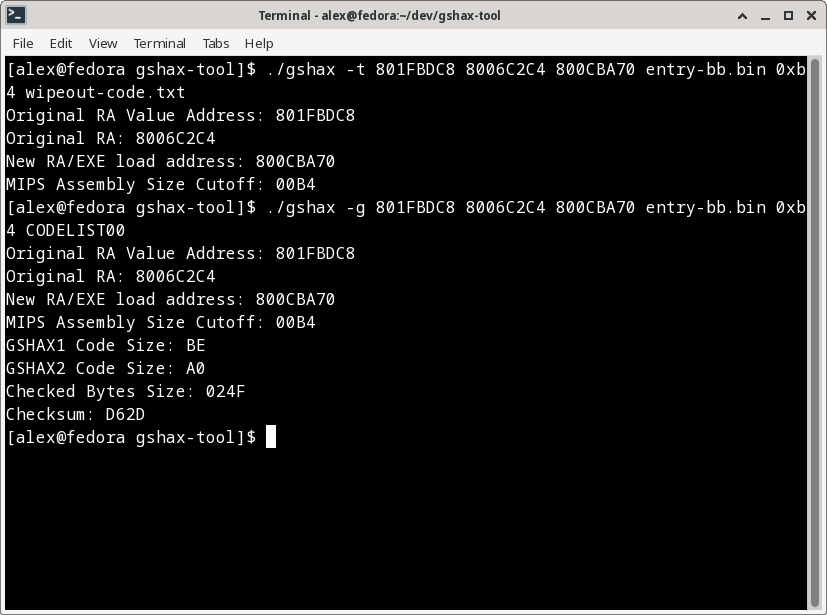
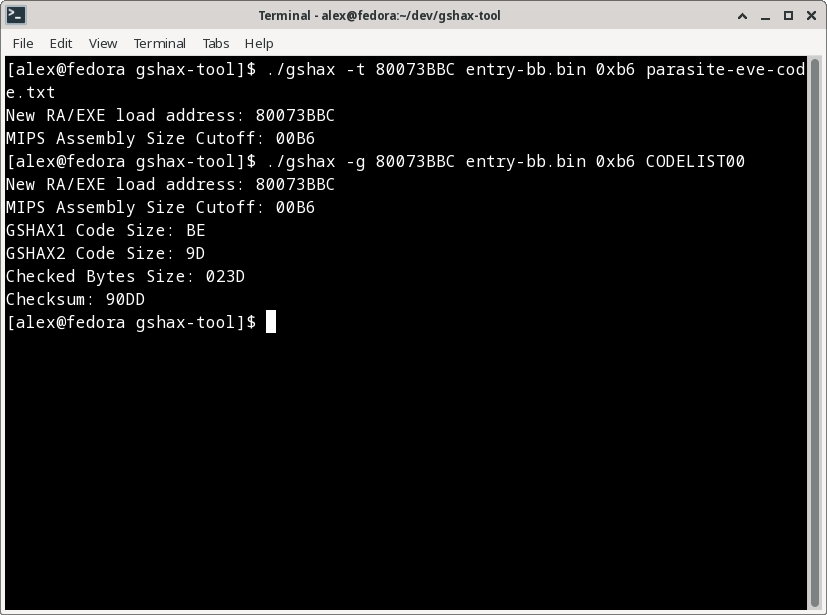
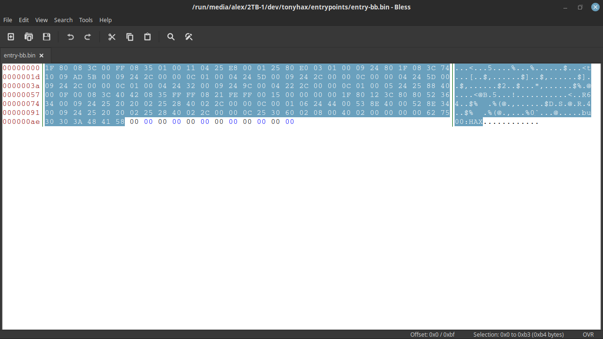
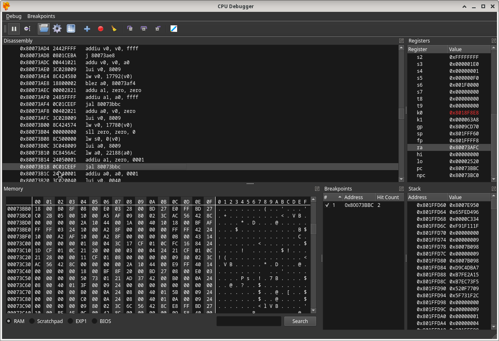
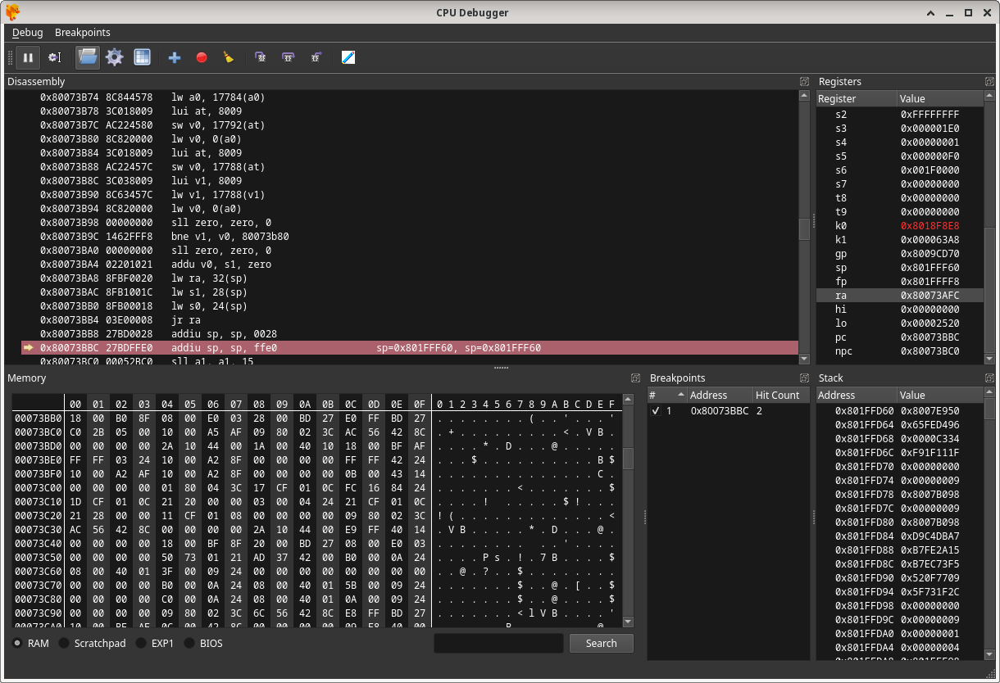
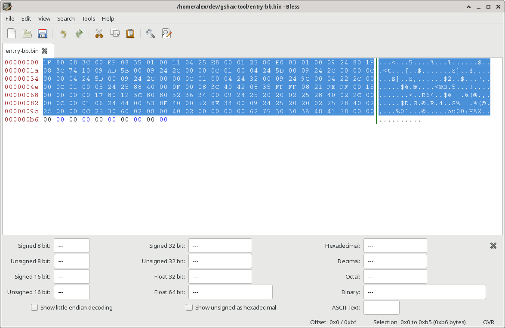

# [alex-free.github.io](https://alex-free.github.io)

By Alex Free & MottZilla

GSHAX Tool is a portable open source program that **can generate complete GSHAX codes from scratch.** GSHAX Tool can output GSHAX codes to either a text file (.txt) or a real valid GameShark Lite save game file.

## What Are GSHAX Codes?

GSHAX codes are PSX GameShark codes that modify an existing function in a running game to _instead_ execute custom MIPS assembly. 

As an example of usefulness, GSHAX codes are used in [Tonyhax International](https://alex-free.github.io/tonyhax-international) to load the Tonyhax International loader PS-EXE off of a memory card in slot 1, enabling the play of backup and import discs with a GameShark or other cheat device. This is very useful for the various PSX cheat devices **that do not already include a built in swap trick [backdoor](https://alex-free.github.io/tonyhax-international/boot-cd).** This is most notably the GameShark Lite (CD), GameShark CDX v3.3 (CD), and GameShark 1.x (cartridge) products.

There are currently 2 different modes that GSHAX Tool can be used in, Mode 0 and Mode 1. These provide 2 different types of vectors to take control away from the original game software. Examples of both modes in use are available below.

## Links

*	[Homepage](https://alex-free.github.io/gshax-tool)
*	[Github](https://github.com/alex-free/gshax-tool)
*	[Tonyhax International](https://alex-free.github.io/tonyhax-international)
*   [PSXDev Research Thread On GSHAX Codes](http://www.psxdev.net/forum/viewtopic.php?f=70&t=4032)

## Downloads

### Version 1.0.1 (3/9/2023)

*	[gshax-tool-1.0.1-windows\_x86](https://github.com/alex-free/gshax-tool/releases/download/v1.0.1/gshax-tool-1.0.1-windows_x86.zip) _For Windows 95 OSR 2.5 Or Newer (32-bit Windows)_
*	[gshax-tool-1.0.1-windows\_x86\_64](https://github.com/alex-free/gshax-tool/releases/download/v1.0.1/gshax-tool-1.0.1-windows_x86_64.zip) _For 64-bit Windows_
*	[gshax-tool-1.0.1-linux\_x86](https://github.com/alex-free/gshax-tool/releases/download/v1.0.1/gshax-tool-1.0.1-linux_x86_static.zip) _For x86 Linux Distros_
*	[gshax-tool-1.0.1-linux\_x86\_64](https://github.com/alex-free/gshax-tool/releases/download/v1.0.1/gshax-tool-1.0.1-linux_x86_64_static.zip) _For x86\_64 Linux Distros_
*	[gshax-tool-1.0.1-source](https://github.com/alex-free/gshax-tool/archive/refs/tags/v1.0.1.zip)

Changes:
*   New Mode 1 has been added.

### Version 1.0 (1/27/2023)

*	[gshax-tool-1.0-windows\_x86](https://github.com/alex-free/gshax-tool/releases/download/v1.0/gshax-tool-1.0-windows_x86.zip) _For Windows 95 OSR 2.5 Or Newer (32-bit Windows)_
*	[gshax-tool-1.0-windows\_x86\_64](https://github.com/alex-free/gshax-tool/releases/download/v1.0/gshax-tool-1.0-windows_x86_64.zip) _For 64-bit Windows_
*	[gshax-tool-1.0-linux\_x86](https://github.com/alex-free/gshax-tool/releases/download/v1.0/gshax-tool-1.0-linux_x86_static.zip) _For x86 Linux Distros_
*	[gshax-tool-1.0-linux\_x86\_64](https://github.com/alex-free/gshax-tool/releases/download/v1.0/gshax-tool-1.0-linux_x86_64_static.zip) _For x86\_64 Linux Distros_
*	[gshax-tool-1.0-source](https://github.com/alex-free/gshax-tool/archive/refs/tags/v1.0.zip)

## Table Of Contents

*   [Creating A GSHAX Code With GSHAX Tool Mode 0](#creating-a-gshax-code-with-gshax-tool-mode-0)
*   [Creating A GSHAX Code With GSHAX Tool Mode 1](#creating-a-gshax-code-with-gshax-tool-mode-1)
*   [License](#license)
*   [Compiling From Source](#compiling-from-source)
*   [Credits](#credits)

## Creating A GSHAX Code With GSHAX Tool Mode 0

*   [Step 1: Emulator Setup](#step-1-emulator-setup-mode-0)
*   [Step 2: Get The Target Function RA Value](#step-2-get-the-target-function-ra-value-mode-0)
*   [Step 3: Get The RAM Address That The Target RA Is Loaded From](#step-3-get-the-ram-address-that-the-target-ra-is-loaded-from-mode-0)
*   [Step 4: Find An Unused Portion Of Zeroed Out Memory In RAM](#step-4-find-an-unused-portion-of-zeroed-out-memory-in-ram-mode-0)
*   [Step 5: Decide On Output Mode](#step-5-decide-on-output-mode-mode-0)
*   [Step 6: Output Filename](#step-6-output-filename-mode-0)
*   [Step 7: MIPS Assembly Binary For Conversion To GameShark Code Filename](#step-7-mips-assembly-binary-for-conversion-to-gameshark-code-filename-mode-0)
*   [Step 8: Offset Value Cutoff For MIPS Assembly Binary](#step-8-offset-value-cutoff-for-mips-assembly-binary-mode-0)

GSHAX Tool is a command line program which **requires 7 arguments in Mode 0**, as described below:

1) - The [output mode](#step-5-decide-on-output-mode-mode-0) (-t for .txt, -g for gslite save game file).
2) - The RAM address that the target RA value is loaded [from](#step-3-get-the-ram-address-that-the-target-ra-is-loaded-from-mode-0).
3) - The [target RA value](#step-2-get-the-target-function-ra-value-mode-0).
4) - The [new RA value](#step-4-find-an-unused-portion-of-zeroed-out-memory-in-ram-mode-0) that doubles as the start addr to the MIPS assembly binary in RAM.
5) - The [filename](#step-7-mips-assembly-binary-for-conversion-to-gameshark-code-filename-mode-0) of the MIPS assembly binary you want to replace the in game function with.
6) - The [offset](#step-8-offset-value-cutoff-for-mips-assembly-binary-mode-0) of the MIPS assembly binary (without padding).
7) - The [filename](#step-6-output-filename-mode-0) of the output generated by GSHAX Tool.

So I ended up with 2 different commands for my [WipEout USA](http://redump.org/disc/2772/) GSHAX code:

`./gshax -t 801FBDC8 8006C2C4 800CBA70 entry-bb.bin 0xb4 wipeout-code.txt`

`./gshax -g 801FBDC8 8006C2C4 800CBA70 entry-bb.bin 0xb4 CODELIST00`

The GSHAX codes in this example will change what happens when you press `START` at the WipEout title screen (the Tonyhax International loader will start).

### Step 1: Emulator Setup (Mode 0)

The first thing to do is fire up the target PSX game that you want to write a GSHAX code for in an emulator so that you can find the values required for input to GSHAX Tool. 

In use the [DuckStation](https://www.duckstation.org/) PSX emulator to find GSHAX codes. In DuckStation you need to enable the `Show Developer Menu` option. This gives you access to the `CPU Debugger` feature of DuckStation that will be used later to figure out the necessary GSHAX input values to create GSHAX codes.

Click `Close` at the bottom of the `Advanced Settings` window to apply the settings.

### Step 2: Get The Target Function RA Value (Mode 0)

Start the game with the `.cue` file:

Go through the game until reaching the target function that will be modified. In my example with WipEout, I choose the title screen. At the title screen, I started the `CPU Debugger` option (which will pause emulation when opened). At the top right of the CPU Debugger is a box containing register values. I found the RA value `8006C2C4`. This is the value that will be replaced by a new one which points to our own MIPS assembly code, known as the 'old ra'. This will be the 3rd argument in our GSHAX Tool command.

### Step 3: Get The RAM Address That The Target RA Is Loaded From (Mode 0)

Now I need to find an address which contains the known RA value `8006C2C4`, this must be the address in RAM that the game uses to get this RA value from. In DuckStation, I continued emulation by making the DuckStation WipEout emulation window active again and then pressed the start menu at the title screen. I then pulled back up the `CPU Debugger` immediately. Good news is, the RA value is still the same after pressing start on the title screen. Now, I'll search for the RA value in the current RAM. I need to do some byte swapping/moving for the search feature of DuckStation, so `8006C2C4` becomes `C4 C2 06 80`, which I can in fact search for and get exactly one match in RAM! This is definitely where the RA value, comes from. The address in the DuckStation `CPU Debugger` is: `001FBDC8`, which is really `801FBDC8` for our purposed with GSHAX codes.

### Step 4: Find An Unused Portion Of Zeroed Out Memory In RAM (Mode 0)

Now we need to find a large chunk of unused, freely available RAM large enough to put the mips assembly binary at without conflicting with any existing game functions. Using the scroll bar in the `Memory` section of the `CPU Debugger` window at the bottom left, I found that there is a large section of zeroed out memory from RAM address `0x800CBA70` to `0x800CE138`, which is 9928 (0x26C8) bytes, way more then we need for the Tonyhax International v1.1.8 `entrypoints/entry-bb.bin` MIPS assembly! All we need for the `entrypoints/entry-bb.bin` MIPS assembly in theory is a `0xb5` section of zeroed out memory.

I decided on using the starting address of `0x800CBA70` to put the MIPS assembly binary at. It's a little after the start of the unused RAM section, for no real reason other then that's where I tried it first in testing.

### Step 5: Decide On Output Mode (Mode 0)

GSHAX Tool can output the complete list of GSHAX codes to 2 formats. A simple .txt file containing all lines of code, or a real valid GameShark Lite save game file which contains all of the codes already entered/activated, which vastly improves how fast you can use GSHAX codes.

If you set the first argument to `-g` you will output a GameShark Lite save game file. If you set the first argument to `-t` you will output a `.txt` text file containing all code lines.

### Step 6: Output Filename (Mode 0)

The 7th argument must be the filename of the new file generated by GSHAX Tool. This must be named `CODELIST00` if you make a GameShark Lite save game file that GameShark Lite will use when copied to a PS1 memory card. 

The GameShark Lite save game file can be placed on a PS1 memory card using a soft-modded PS2 or other methods of writing custom files to PS1 memory cards. Once you have the memory card containing the **GameShark Lite save game file (must be named `CODELIST00`)** in slot 1 of your USA console:

*   Turn on your console with the GameShark Lite disc in the closed CD drive.
*   Wait for GameShark Lite to load through the `This product is NOT licensed or endorsed by SCEA` disclaimer, skip through the FMV, and then select the `Start GS lite` option in the GameShark Lite boot menu.
*   The GameShark Lite reads from the memory card in slot 1 of the console at boot, looking for any GameShark Lite CD save files. If it finds one it will display the message `Codes Loaded. Press O`.
*   After Pressing `O` you will be back at the GameShark Lite `Main Menu`. Use the `D-PAD` to navigate to the `Select Cheat Codes` option, and select it by pressing the `X` button.
*   The game title named `A` will be automatically highlighted when you enter the `Select Cheat Codes` menu, which means the GSHAX codes will be automatically enabled. There are 2 codes for each GameSharkHAX game, so if you see in the bottom box the text `2 Cheat Codes Are On` for the `A` game title then you can simply press the `O` button to return to the `Main Menu`.
*   Use the `D-PAD` to navigate to the `Start Game` option, and select it with the `X` button.
*   In the `Start Game Options` menu, the `Start Game With Selected Codes` option will already be highlighted. Press the `X` button to select it. You will see a text box which says `Open PlayStation CD lid. Remove GameShark CD. Insert Game CD. Close CD lid.` follow those instructions, inserting the GameSharkHAX compatible game disc.
*   Once the GameSharkHAX compatible game boots, go to the function modified by the GSHAX codes. In my example, I played to the title screen, and then pressed the start button.

### Step 7: MIPS Assembly Binary For Conversion To GameShark Code Filename (Mode 0)

The filename of the actual MIPS assembly binary is argument 5, in this example: `entry-bb.bin`.

### Step 8: Offset Value Cutoff For MIPS Assembly Binary (Mode 0)

The MIPS assembly binary must be **an even value no larger then 248 (0xF8) bytes in size**. In my example, I am using the size-optimized 1st stage loader used by some save game exploits in Tonyhax International. The `entrypoints/entry-bb.bin` MIPS assembly binary generated for Tonyhax International v1.1.8 is 192 (0xC0) bytes. This can be stripped to 180 bytes, or 0xb4 in hex however because there is nothing but 0x00 bytes after offset 0xb4 (and we are going to write it into a large space of zeroed out RAM already).

## Creating A GSHAX Code With GSHAX Tool Mode 1

*   [Step 1: Emulator Setup](#step-1-emulator-setup-mode-1)
*   [Step 2: Decide On Output Mode](#step-2-decide-on-output-mode-mode-1)
*   [Step 3: Find An exploitable JAL Destination Address](#step-3-find-an-exploitable-jal-destination-address-mode-1)
*   [Step 4: Output Filename](#step-4-output-filename-mode-1)
*   [Step 5: MIPS Assembly Binary For Conversion To GameShark Code Filename](#step-5-mips-assembly-binary-for-conversion-to-gameshark-code-filename-mode-1)
*   [Step 6: Offset Value Cutoff For MIPS Assembly Binary](#step-6-offset-value-cutoff-for-mips-assembly-binary-mode-1)

GSHAX Tool is a command line program which **requires 5 arguments in Mode 1**, as described below:

1) - The [output mode](#step-2-decide-on-output-mode-mode-1) (-t for .txt, -g for gslite save game file).
2) - The [exploitable JAL address](#step-3-find-an-exploitable-jal-destination-address-mode-1).
3) - The [filename](#step-4-mips-assembly-binary-for-conversion-to-gameshark-code-filename-mode-1) of the MIPS assembly binary you want to replace the in game function with.
4) - The [offset](#step-6-offset-value-cutoff-for-mips-assembly-binary-mode-1) of the MIPS assembly binary (without padding).
5) - The [filename](#step-4-output-filename-mode-1) of the output generated by GSHAX Tool.

So I ended up with 2 different commands for my [Parasite Eve USA Disc 1 or Disc 2](http://redump.org/disc/116/) GSHAX code:

`./gshax -t 80073BBC entry-bb.bin 0xb6 parasite-eve-code.txt`

`./gshax -g 80073BBC entry-bb.bin 0xb6 CODELIST00`

The GSHAX codes in this example will change what happens when Parasite Eve boots. Instead of displaying the intro FMVs, the Tonyhax International loader will start after a brief black screen and some disc seeks (which is the only code from the original game that still runs with this code enabled, actually).

### Step 1: Emulator Setup (Mode 1)

The first thing to do is fire up the target PSX game that you want to write a GSHAX code for in an emulator so that you can find the values required for input to GSHAX Tool. 

In use the [DuckStation](https://www.duckstation.org/) PSX emulator to find GSHAX codes. In DuckStation you need to enable the `Show Developer Menu` option. This gives you access to the `CPU Debugger` feature of DuckStation that will be used later to figure out the necessary GSHAX input values to create GSHAX codes.

Click `Close` at the bottom of the `Advanced Settings` window to apply the settings.

### Step 2: Decide On Output Mode (Mode 1)

GSHAX Tool can output the complete list of GSHAX codes to 2 formats. A simple .txt file containing all lines of code, or a real valid GameShark Lite save game file which contains all of the codes already entered/activated, which vastly improves how fast you can use GSHAX codes.

If you set the first argument to `-g` you will output a GameShark Lite save game file. If you set the first argument to `-t` you will output a `.txt` text file containing all code lines.

### Step 3: Find An Exploitable JAL Destination Address (Mode 1)

This is the tricky bit, and it won't work for every game. Somehow, it does work for Parasite Eve USA (Disc 1 or Disc 2).

You need to find a JAL (Jump and Link) instruction that goes to an area of RAM that:

*   Is not in the same area of RAM being used by that function.
*   Has not been used previously by the BIOS/kernel and any game function up to the point of the JAL.
*   When overwritten, does not screw up the surrounding code.

With some luck, you may find what your looking for, the perfect JAL. In Parasite Eve USA, this JAL is found at `0x80073B18`, which jumps and links to `0x80073BBC`:

So that magic number **`0x80073BBC` is the second argument** to GSHAX Tool in Mode 1 for this code.

### Step 4: Output Filename (Mode 1)

The 7th argument must be the filename of the new file generated by GSHAX Tool. This must be named `CODELIST00` if you make a GameShark Lite save game file that GameShark Lite will use when copied to a PS1 memory card. 

The GameShark Lite save game file can be placed on a PS1 memory card using a soft-modded PS2 or other methods of writing custom files to PS1 memory cards. Once you have the memory card containing the **GameShark Lite save game file (must be named `CODELIST00`)** in slot 1 of your USA console:

*   Turn on your console with the GameShark Lite disc in the closed CD drive.
*   Wait for GameShark Lite to load through the `This product is NOT licensed or endorsed by SCEA` disclaimer, skip through the FMV, and then select the `Start GS lite` option in the GameShark Lite boot menu.
*   The GameShark Lite reads from the memory card in slot 1 of the console at boot, looking for any GameShark Lite CD save files. If it finds one it will display the message `Codes Loaded. Press O`.
*   After Pressing `O` you will be back at the GameShark Lite `Main Menu`. Use the `D-PAD` to navigate to the `Select Cheat Codes` option, and select it by pressing the `X` button.
*   The game title named `A` will be automatically highlighted when you enter the `Select Cheat Codes` menu, which means the GSHAX codes will be automatically enabled. There are 2 codes for each GameSharkHAX game, so if you see in the bottom box the text `2 Cheat Codes Are On` for the `A` game title then you can simply press the `start` button to continue to the `Start Game Options` menu.
*   In the `Start Game Options` menu, the `Start Game With Selected Codes` option will already be highlighted. Press the `X` button to select it. You will see a text box which says `Open PlayStation CD lid. Remove GameShark CD. Insert Game CD. Close CD lid.` follow those instructions, inserting the GameSharkHAX compatible game disc.
*   Once the GameSharkHAX compatible game boots, go to the function modified by the GSHAX codes. In my example, I played to the title screen, and then pressed the start button.

### Step 5: MIPS Assembly Binary For Conversion To GameShark Code Filename (Mode 1)

**The filename of the actual MIPS assembly binary is argument 3**, in this example: `entry-bb.bin`.

### Step 6: Offset Value Cutoff For MIPS Assembly Binary (Mode 1)

The MIPS assembly binary must be **an even value no larger then 248 (0xF8) bytes in size**. In my example, I am using the size-optimized 1st stage loader used by some save game exploits in Tonyhax International. The `entrypoints/entry-bb.bin` MIPS assembly binary generated for Tonyhax International v1.1.9 is 192 (0xC0) bytes. This can be stripped to 182 bytes, or 0xb6 in hex however because there is nothing but 0x00 bytes after offset 0xb4 (we only need termination of the file at the end since it is not guaranteed in RAM).

This means **the 4th argument is `0xb6`** in this example (although strangely, `0xb4` seems to work OK for Parasite Eve?).

## License

GSHAX Tool is open source software released under the 3-BSD license. Please see the file `license.txt` in each GSHAX Tool release for full info.

## Compiling From Source

[Download](#downloads) the source, and simply execute `make`.

## Credits

Huge thanks to MottZilla for helping reverse how the GameShark Lite save game file is read and generated, most notably how the checksum and checked area is calculated.