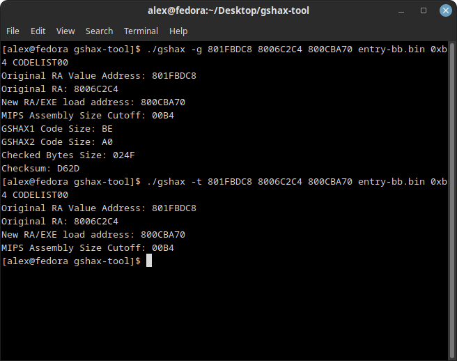
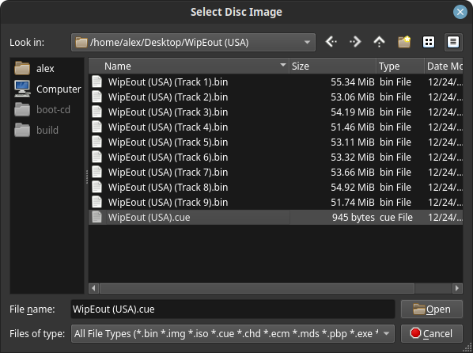
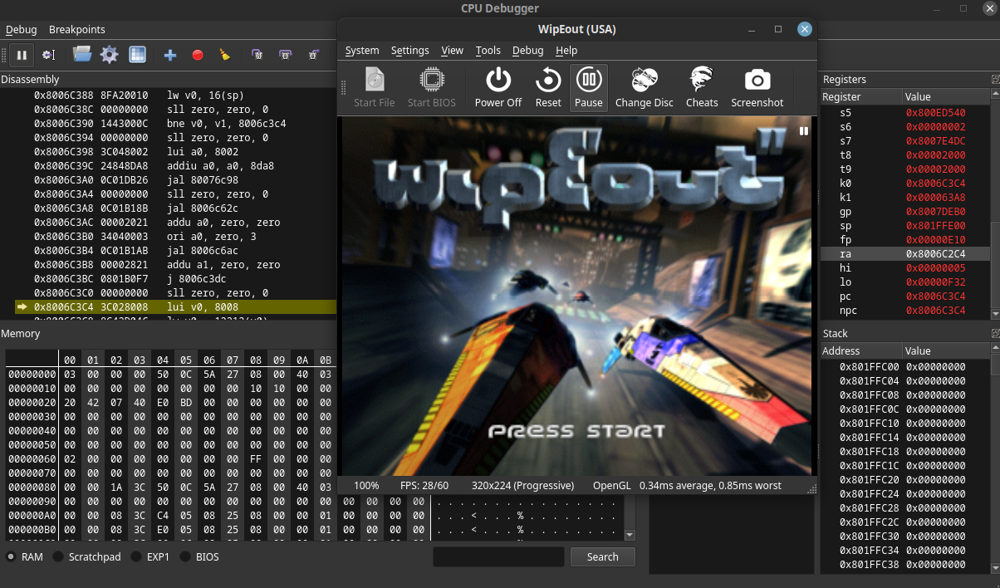
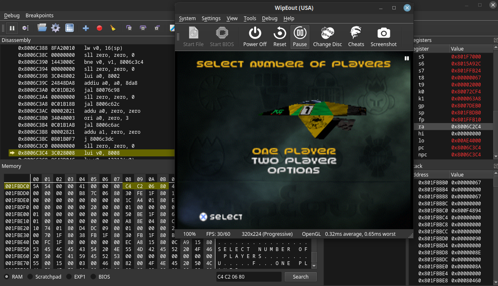
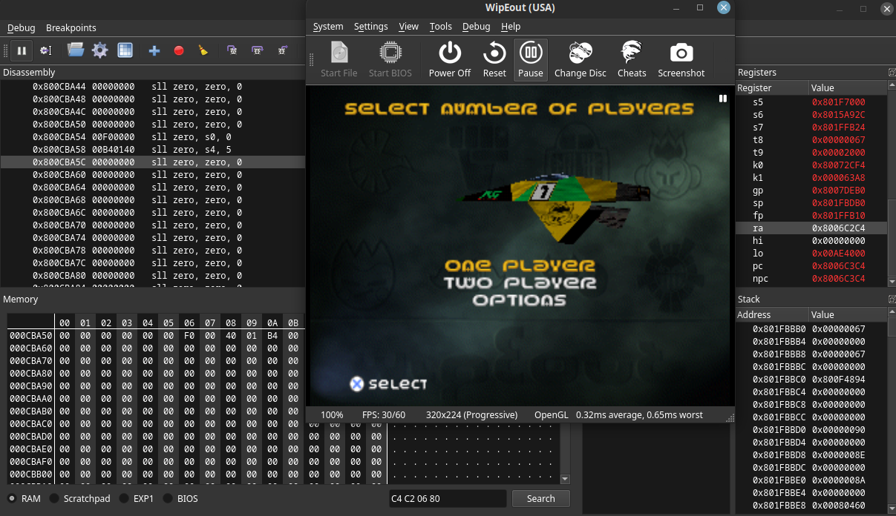
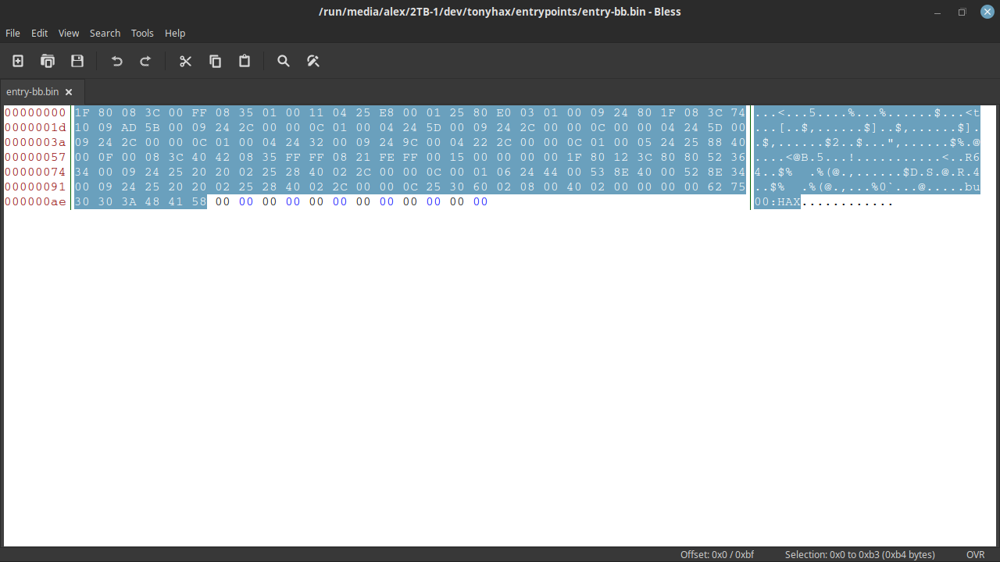

# [alex-free.github.io](https://alex-free.github.io)

By Alex Free & MottZilla

GSHAX Tool is a portable open source program that **can generate complete GSHAX codes from scratch.** GSHAX Tool can output GSHAX codes to either a text file (.txt) or a real valid GameShark Lite save game file.

## What Are GSHAX Codes?

GSHAX codes are PSX GameShark codes that modify an existing function in a running game to _instead_ execute custom MIPS assembly. 

As an example of usefulness, GSHAX codes are used in [Tonyhax International](https://alex-free.github.io/tonyhax-international) to load the Tonyhax International loader PS-EXE off of a memory card in slot 1, enabling the play of backup and import discs with a GameShark or other cheat device. This is very useful for the various PSX cheat devices **that do not include a built in swap trick.** Before you decide to [create a GSHAX code](#creating-a-gshax-code-with-gshax-tool-example), it is a good idea to see if your PSX cheat device [includes a swap trick](#psx-cheat-device-overview) as that can be used much more conveniently to boot the Tonyhax International [Boot CD](https://alex-free.github.io/tonyhax-international/boot-cd.html) in such a use case.

## Links

*	[Homepage](https://alex-free.github.io/gshax-tool)
*	[Github](https://github.com/alex-free/gshax-tool)
*	[Tonyhax International](https://alex-free.github.io/tonyhax-international)
*   [PSXDev Research Thread On GSHAX Codes](http://www.psxdev.net/forum/viewtopic.php?f=70&t=4032)

## Downloads

### Version 1.0 (1/27/2023)

*	[gshax-tool-1.0-windows\_x86](https://github.com/alex-free/gshax-tool/releases/download/v1.0/gshax-tool-1.0-windows_x86.zip) _For Windows 95 OSR 2.5 Or Newer (32-bit Windows)_
*	[gshax-tool-1.0-windows\_x86\_64](https://github.com/alex-free/gshax-tool/releases/download/v1.0/gshax-tool-1.0-windows_x86_64.zip) _For 64-bit Windows_
*	[gshax-tool-1.0-linux\_x86](https://github.com/alex-free/gshax-tool/releases/download/v1.0/gshax-tool-1.0-linux_x86_static.zip) _For x86 Linux Distros_
*	[gshax-tool-1.0-linux\_x86\_64](https://github.com/alex-free/gshax-tool/releases/download/v1.0/gshax-tool-1.0-linux_x86_64_static.zip) _For x86_64 Linux Distros_
*	[gshax-tool-1.0-source](https://github.com/alex-free/gshax-tool/archive/refs/tags/v1.0.zip)

You can also get the source using git: 

`git clone https://github.com/alex-free/gshax-tool`

## Table Of Contents

*   [PSX Cheat Device Overview](#psx-cheat-device-overview)
*   [GameShark Swap Tricks](#gameshark-swap-tricks)
*   [GameShark Cartridge Swap Trick](#gameshark-cartridge-swap-trick)
*   [GameShark CD Swap Trick](#gameshark-cd-swap-trick)
*   [Creating A GSHAX Code With GSHAX Tool](#creating-a-gshax-code-with-gshax-tool-example)
*   [Step 1: Emulator Setup](#step-1-emulator-setup)
*   [Step 2: Get The Target Function RA Value (Argument 3)](#step-2-get-the-target-function-ra-value-argument-3)
*   [Step 3: Get The RAM Address That The Target RA Is Loaded From (Argument 2)](#step-3-get-the-ram-address-that-the-target-ra-is-loaded-from-argument-2)
*   [Step 4: Find An Unused Portion Of Zeroed Out Memory In RAM (Argument 4)](#step-4-find-an-unused-portion-of-zeroed-out-memory-in-ram-argument-4)
*   [Step 5: Decide On Output Mode (Argument 1)](#step-5-decide-on-output-mode-argument-1)
*   [Step 6: Output Filename (Argument 7)](#step-6-output-filename-argument-7)
*   [Step 7: MIPS Assembly Binary For Conversion To GameShark Code Filename (Argument 5)](#step-7-mips-assembly-binary-for-conversion-to-gameshark-code-filename-argument-5)
*   [Step 8: Offset Value Cutoff For MIPS Assembly Binary (Argument 6)](#step-8-offset-value-cutoff-for-mips-assembly-binary-argument-6)
*   [License](#license)
*   [Compiling From Source](#compiling-from-source)
*   [Credits](#credits)

## PSX Cheat Device Overview

While GSHAX codes can work on any PSX cheat device, they are most useful for the cheat devices which **do not have a built-in swap trick**:

|                    |                  |                                      |                                          |
|--------------------|------------------|--------------------------------------|------------------------------------------|
| Cheat Device       | Type Of Device   | Has A Built-In Swap Trick Back Door? | Supports Storing Codes On A Memory Card? |
| GameShark v1.x     | Cartridge        | No                                   | Yes                                      |
| GameShark v2.x     | Cartridge        | Yes                                  | Yes                                      |
| GameShark v3.0-3.2 | Cartridge        | Yes                                  | Yes                                      |
| GameShark CDX v3.3 | CD               | No                                   | No, requires proprietary PS1 memory card  dongle device |
| GameShark Lite     | CD               | No                                   | Yes |
| GameShark v4.0     | CD               | Yes                                  | Yes |
| GameShark v5.0     | CD               | Yes                                  | Yes |
| GameShark v6.0     | CD               | Yes                                  | Yes |

## GameShark Swap Tricks

There are 2 different kinds of swap tricks that are available in some GameShark versions.

The [GameShark cartridge swap trick](#gameshark-cartridge-swap-trick) can be used on any PSX console model which has a cartridge port on the back, which includes the SCPH-1000-SCPH-7502 as the region of the console does not matter.

The [GameShark CD swap trick](#gameshark-cd-swap-trick) can be used on any USA PSX or PS2 console since the GameShark CD versions are detected as real licensed SCEA PSX discs.

### GameShark Cartridge Swap Trick

The GameShark v2.0 cartridge introduced the CD Player option in the Explorer feature of the GameShark menu. The GameShark cartidge Swap Trick can boot the Tonyhax International [Boot CD](https://alex-free.github.io/tonyhax-international/boot-cd.html) directly, which is more convenient then using GSHAX codes. It can be used on all GameShark v2.x and v3.x cartridges as described below:

*   Ensure that the GameShark cheat cart is firmly inserted into the back of your compatible PSX console. 
*   Find something to block the lid sensor. The CD drive lid should remain 'opened' with the lid sensor blocked for at least the rest of the Swap Trick.
*   Turn on the PSX with a real PSX game disc (that is the same region as your console) in the closed CD drive.
*   After the GameShark logo displays, use the `D-PAD` to navigate to the `Explorer` option in the GameShark main menu, then select it with the `X` button.
*   Use the `D-PAD` to navigate to the `Play CD Music` option in the `Explorer` sub-menu. You will see the message `Initializing CD System` for a few seconds, and then the `CD Audio Player` sub-menu will appear and the authentic PSX game disc will stop spinning.
*   Replace the authentic PSX game disc (that is the same region as your console) with the burned Tonyhax International Boot CD-R.
*   Press the `O` button to exit the `CD Audio Player` sub-menu, and to put you back at the `Explorer` sub-menu. Press the `O` button one last time to exit the `Explorer` menu, and to put you back at the main menu.
*   Use the `D-PAD` to navigate to the `Start Game` option, then select it with the `X` button. This will bring you to the `Start Game Options` sub-menu. Finally, press the `X` button one last time to select the `Start Game Without Codes` option which will boot the Tonyhax International Boot CD-R.

### GameShark CD Swap Trick

The swap trick ability of the GameShark briefly disappeared when the product first shifted from a cartridge to a CD. **While the swap trick ability is not found in the GameShark CDX v3.3 or GameShark Lite**, a different swap trick was added to the GameShark v4.0 CD and all newer versions. It is described below:

*   Find something to block the lid sensor. The CD drive lid should remain 'opened' with the lid sensor blocked for the rest of the Swap Trick.
*   Turn on the console with the GameShark CD in the CD drive, it will spin up and start the GameShark software.
*   Once the GameShark software starts, **the GameShark CD will stop in the CD drive.**
*   Replace the GameShark CD with the burned Tonyhax International Boot CD-R.
*   Use the `D-PAD` to navigate to the `Start Game` option, then select it with the `X` button. This will bring you to the `Start Game Options` sub-menu. Press the `X` button to select the `Start Game Without Codes` option.
*   Finally, press the 'X' button one last time to boot the Tonyhax International Boot CD-R.

## Creating A GSHAX Code With GSHAX Tool (Example)

GSHAX Tool is a command line program which **requires 7 arguments**, as described below:

1) - The [output mode](#step-5-decide-on-output-mode-argument-1) (-t for .txt, -g for gslite save game file).
2) - The RAM address that the target RA value is loaded [from](#step-3-get-the-ram-address-that-the-target-ra-is-loaded-from-argument-2).
3) - The [target RA value](#step-2-get-the-target-function-ra-value-argument-3).
4) - The [new RA value](#step-4-find-an-unused-portion-of-zeroed-out-memory-in-ram-argument-4) that doubles as the start addr to the MIPS assembly binary in RAM.
5) - The [filename](#step-7-mips-assembly-binary-for-conversion-to-gameshark-code-filename-argument-5) of the MIPS assembly binary you want to replace the in game function with.
6) - The [offset](#step-8-offset-value-cutoff-for-mips-assembly-binary-argument-6) of the MIPS assembly binary (without padding).
7) - The [filename](#step-6-output-filename-argument-7) of the output generated by GSHAX Tool.

So I ended up with 2 different commands for my [WipEout USA](http://redump.org/disc/2772/) GSHAX code:

`./gshax -t 801FBDC8 8006C2C4 800CBA70 entry-bb.bin 0xb4 wipeout-code.txt`

`./gshax -g 801FBDC8 8006C2C4 800CBA70 entry-bb.bin 0xb4 CODELIST00`

The GSHAX codes in this example will change what happens when you press `START` at the WipEout title screen (the Tonyhax International loader will start).

`wipeout-code.txt`:

D01FBDC8 C2C4

801FBDC8 BA70

D01FBDCA 8006

801FBDCA 800C

800CBA70 801F

800CBA72 3C08

800CBA74 FF00

800CBA76 3508

800CBA78 0001

800CBA7A 0411

800CBA7C E825

800CBA7E 0100

800CBA80 8025

800CBA82 03E0

800CBA84 0001

800CBA86 2409

800CBA88 1F80

800CBA8A 3C08

800CBA8C 1074

800CBA8E AD09

800CBA90 005B

800CBA92 2409

800CBA94 002C

800CBA96 0C00

800CBA98 0001

800CBA9A 2404

800CBA9C 005D

800CBA9E 2409

800CBAA0 002C

800CBAA2 0C00

800CBAA4 0000

800CBAA6 2404

800CBAA8 005D

800CBAAA 2409

800CBAAC 002C

800CBAAE 0C00

800CBAB0 0001

800CBAB2 2404

800CBAB4 0032

800CBAB6 2409

800CBAB8 009C

800CBABA 2204

800CBABC 002C

800CBABE 0C00

800CBAC0 0001

800CBAC2 2405

800CBAC4 8825

800CBAC6 0040

800CBAC8 000F

800CBACA 3C08

800CBACC 4240

800CBACE 3508

800CBAD0 FFFF

800CBAD2 2108

800CBAD4 FFFE

800CBAD6 1500

800CBAD8 0000

800CBADA 0000

800CBADC 801F

800CBADE 3C12

800CBAE0 8080

800CBAE2 3652

800CBAE4 0034

800CBAE6 2409

800CBAE8 2025

800CBAEA 0220

800CBAEC 2825

800CBAEE 0240

800CBAF0 002C

800CBAF2 0C00

800CBAF4 0100

800CBAF6 2406

800CBAF8 0044

800CBAFA 8E53

800CBAFC 0040

800CBAFE 8E52

800CBB00 0034

800CBB02 2409

800CBB04 2025

800CBB06 0220

800CBB08 2825

800CBB0A 0240

800CBB0C 002C

800CBB0E 0C00

800CBB10 3025

800CBB12 0260

800CBB14 0008

800CBB16 0240

800CBB18 0000

800CBB1A 0000

800CBB1C 7562

800CBB1E 3030

800CBB20 483A

800CBB22 5841

### Step 1: Emulator Setup

The first thing to do is fire up the target PSX game that you want to write a GSHAX code for in an emulator so that you can find the values required for input to GSHAX Tool. 

In this example, I am using a copy of [WipEout USA](http://redump.org/disc/2772/) with the [DuckStation](https://www.duckstation.org/) PSX emulator. In DuckStation you need to enable the `Show Developer Menu` option. This gives you access to the `CPU Debugger` feature of DuckStation that will be used later to figure out the necessary GSHAX input values to create GSHAX codes.

Click `Close` at the bottom of the `Advanced Settings` window to apply the settings.

### Step 2: Get The Target Function RA Value (Argument 3)

Start the game with the `.cue` file:

Go through the game until reaching the target function that will be modified. In my example with WipEout, I choose the title screen. At the title screen, I started the `CPU Debugger` option (which will pause emulation when opened). At the top right of the CPU Debugger is a box containing register values. I found the RA value `8006C2C4`. This is the value that will be replaced by a new one which points to our own MIPS assembly code, known as the 'old ra'. This will be the 3rd argument in our GSHAX Tool command.

### Step 3: Get The RAM Address That The Target RA Is Loaded From (Argument 2)

Now I need to find an address which contains the known RA value `8006C2C4`, this must be the address in RAM that the game uses to get this RA value from. In DuckStation, I continued emulation by making the DuckStation WipEout emulation window active again and then pressed the start menu at the title screen. I then pulled back up the `CPU Debugger` immediately. Good news is, the RA value is still the same after pressing start on the title screen. Now, I'll search for the RA value in the current RAM. I need to do some byte swapping/moving for the search feature of DuckStation, so `8006C2C4` becomes `C4 C2 06 80`, which I can in fact search for and get exactly one match in RAM! This is definitely where the RA value, comes from. The address in the DuckStation `CPU Debugger` is: `001FBDC8`, which is really `801FBDC8` for our purposed with GSHAX codes.

### Step 4: Find An Unused Portion Of Zeroed Out Memory In RAM (Argument 4)

Now we need to find a large chunk of unused, freely available RAM large enough to put the mips assembly binary at without conflicting with any existing game functions. Using the scroll bar in the `Memory` section of the `CPU Debugger` window at the bottom left, I found that there is a large section of zeroed out memory from RAM address `0x800CBA70` to `0x800CE138`, which is 9928 (0x26C8) bytes, way more then we need for the Tonyhax International v1.1.8 `entrypoints/entry-bb.bin` MIPS assembly! All we need for the `entrypoints/entry-bb.bin` MIPS assembly in theory is a `0xb5` section of zeroed out memory.

I decided on using the starting address of `0x800CBA70` to put the MIPS assembly binary at. It's a little after the start of the unused RAM section, for no real reason other then that's where I tried it first in testing.

### Step 5: Decide On Output Mode (Argument 1)

GSHAX Tool can output the complete list of GSHAX codes to 2 formats. A simple .txt file containing all lines of code, or a real valid GameShark Lite save game file which contains all of the codes already entered/activated, which vastly improves how fast you can use GSHAX codes.

If you set the first argument to `-g` you will output a GameShark Lite save game file. If you set the first argument to `-t` you will output a `.txt` text file containing all code lines.

### Step 6: Output Filename (Argument 7)

The 7th argument must be the filename of the new file generated by GSHAX Tool. This must be named `CODELIST00` if you make a GameShark Lite save game file that GameShark Lite will use when copied to a PS1 memory card. 

The GameShark Lite save game file can be placed on a PS1 memory card using a soft-modded PS2 or other methods of writing custom files to PS1 memory cards. Once you have the memory card containing the **GameShark Lite save game file (must be named `CODELIST00`)** in slot 1 of your USA console:

*   Turn on your console with the GameShark Lite disc in the closed CD drive.
*   Wait for GameShark Lite to load through the `This product is NOT licensed or endorsed by SCEA` disclaimer, skip through the FMV, and then select the `Start GS lite` option in the GameShark Lite boot menu.
*   The GameShark Lite reads from the memory card in slot 1 of the console at boot, looking for any GameShark Lite CD save files. If it finds one it will display the message `Codes Loaded. Press O`.
*   After Pressing `O` you will be back at the GameShark Lite `Main Menu`. Use the `D-PAD` to navigate to the `Select Cheat Codes` option, and select it by pressing the `X` button.
*   The game title named `A` will be automatically highlighted when you enter the `Select Cheat Codes` menu, which means the GSHAX codes will be automatically enabled. There are 2 codes for each GameSharkHAX game, so if you see in the bottom box the text `2 Cheat Codes Are On` for the `A` game title then you can simply press the `O` button to return to the `Main Menu`.
*   Use the `D-PAD` to navigate to the `Start Game` option, and select it with the `X` button.
*   In the `Start Game Options` menu, the `Start Game With Selected Codes` option will already be highlighted. Press the `X` button to select it. You will see a text box which says `Open PlayStation CD lid. Remove GameShark CD. Insert Game CD. Close CD lid.` follow those instructions, inserting the GameSharkHAX compatible game disc.
*   Once the GameSharkHAX compatible game boots, go to the function modified by the GSHAX codes. In my example, I played to the title screen, and then pressed the start button.

### Step 7: MIPS Assembly Binary For Conversion To GameShark Code Filename (Argument 5)

The filename of the actual MIPS assembly binary is argument 5, in this example: `entry-bb.bin`.

### Step 8: Offset Value Cutoff For MIPS Assembly Binary (Argument 6)

The MIPS assembly binary must be **an even value no larger then 248 (0xF8) bytes in size**. In my example, I am using the size-optimized 1st stage loader used by some save game exploits in Tonyhax International. The `entrypoints/entry-bb.bin` MIPS assembly binary generated for Tonyhax International v1.1.8 is 192 (0xC0) bytes. This can be stripped to 180 bytes, or 0xb4 in hex however because there is nothing but 0x00 bytes after offset 0xb4 (and we are going to write it into a large space of zeroed out RAM already).

## License

GSHAX Tool is open source software released under the 3-BSD license. Please see the file `license.txt` in each GSHAX Tool release for full info.

## Compiling From Source

[Download](#downloads) the source, and simply execute `make`.

## Credits

Huge thanks to MottZilla for helping reverse how the GameShark Lite save game file is read and generated, most notably how the checksum and checked area is calculated.