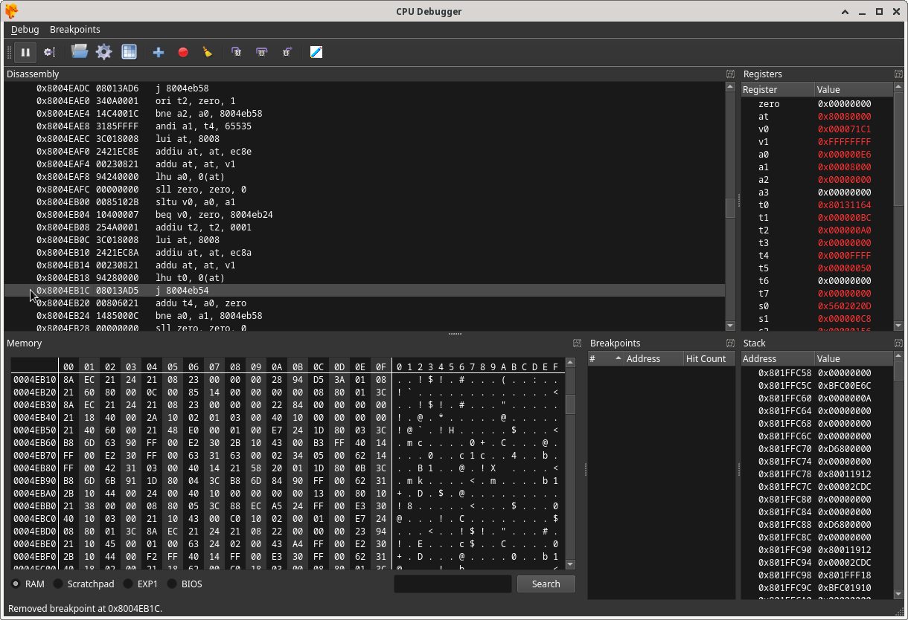
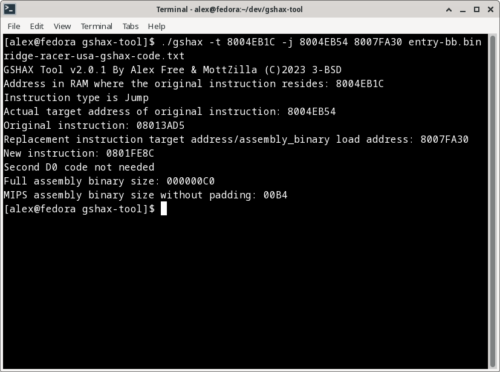
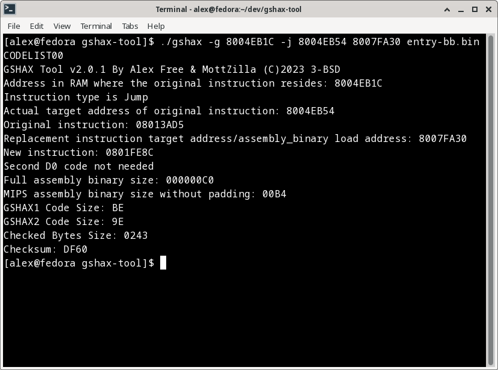

# [alex-free.github.io](https://alex-free.github.io)

# GSHAX Tool

By Alex Free & MottZilla

GSHAX codes are PSX GameShark codes that modify an existing function in a game to _instead_ execute custom MIPS assembly. It works by changing an existing jump or jump and link instruction in an existing game to instead go to a free RAM address location of your choosing, which will contain the custom MIPS assembly to execute instead of the original game function.

GSHAX Tool can generate complete GSHAX codes from scratch. Code can be generated to either a text file (.txt) or a real valid GameShark Lite save game file. The GameShark Lite save game file can be placed on the memory card in slot 1. As long as it is named `CODELIST00`, it will automatically load the GSHAX codes into the database, making it supper easy to use the GameShark Lite CD with GSHAX Tool generated codes. For more information, see the [GameSharkHAX](https://alex-free.github.io/tonyhax-international/gameshark-code) page on Tonyhax International.

As an example of usefulness, GSHAX codes are [used](https://github.com/alex-free/tonyhax/blob/master/gshax/Makefile) in [Tonyhax International](https://alex-free.github.io/tonyhax-international) to load the Tonyhax International loader PS-EXE off of a memory card in slot 1, enabling the play of backup and import discs with a GameShark or other cheat device. This is very useful for the various PSX cheat devices **that do not already include a built in swap trick [backdoor](https://alex-free.github.io/tonyhax-international/boot-cd).** This is most notably the GameShark Lite (CD), GameShark CDX v3.3 (CD), and GameShark 1.x (cartridge) products.

## Links

*	[Homepage](https://alex-free.github.io/gshax-tool)
*	[Github](https://github.com/alex-free/gshax-tool)
*	[Tonyhax International](https://alex-free.github.io/tonyhax-international)
*   [PSXDev Research Thread On GSHAX Codes](http://www.psxdev.net/forum/viewtopic.php?f=70&t=4032)
*   [GBATemp Thread](https://gbatemp.net/threads/gshax-tool-create-psx-gameshark-codes-that-gain-code-execution-mid-game.625277/)

## Downloads

### Version 2.0.1 (4/3/2023)

*	[gshax-tool-v2.0.1-windows\_x86](https://github.com/alex-free/gshax-tool/releases/download/v2.0.1/gshax-tool-2.0.1-windows_x86.zip) _For Windows 95 OSR 2.5 Or Newer (32-bit Windows)_
*	[gshax-tool-v2.0.1-windows\_x86\_64](https://github.com/alex-free/gshax-tool/releases/download/v2.0.1/gshax-tool-2.0.1-windows_x86_64.zip) _For 64-bit Windows_
*	[gshax-tool-v2.0.1-linux\_x86](https://github.com/alex-free/gshax-tool/releases/download/v2.0.1/gshax-tool-2.0.1-linux_x86_static.zip) _For x86 Linux Distros_
*	[gshax-tool-v2.0.1-linux\_x86\_64](https://github.com/alex-free/gshax-tool/releases/download/v2.0.1/gshax-tool-2.0.1-windows_x86_64.zip) _For x86\_64 Linux Distros_
*	[gshax-tool-v2.0.1-source](https://github.com/alex-free/gshax-tool/archive/refs/tags/v2.0.1.zip)

Changes:

*   The MIPS assembly binary padding offset is now calculated automatically by the tool itself, which means GSHAX Tool now requires 7 arguments instead of 8. 

[About previous versions.](changelog.md)

## Table Of Contents

*   [Usage](#usage)
*   [Step 1: Setup The DuckStation Emulator](#step-1-setup-the-duckstation-emulator)
*   [Step 2: Find An Exploitable CPU Instruction In The Target Game](#step-2-find-an-exploitable-cpu-instruction-in-the-target-game)
*   [Step 3: The MIPS Assembly Binary](#step-3-the-mips-assembly-binary)
*   [Step 4: Gather Inputs For Code Creation](#step-4-gather-inputs-for-code-creation)
*   [Step 5: Generate Codes](#step-5-generate-codes)
*   [License](#license)
*   [Compile From Source](#compile-from-source)
*   [Credits](#credits)

## Usage

GSHAX Tool generates game specific codes. As one game can have different regional releases, updated versions, or multiple discs, it may or may not be required to find new codes for the various scenarios above.

## Step 1: Setup The DuckStation Emulator

GSHAX Tool is designed specifically with the [DuckStation](https://www.duckstation.org/) emulator in mind (all though other emulators, especially No $ PSX should work just as well). The DuckStation emulator's CPU Debugger feature is the easiest way to find the required input values to create a GSHAX code. It is not enabled by default, so this needs to be setup before continuing.

After starting the DuckStation emulator, you need to enable the `Show Developer Menu` option. This is what gives you access to the `CPU Debugger` feature. To do so, click on the `Settings` menu item at the top of the window, and then click `Advanced Settings` in the drop down menu selection as displayed below: 

Ensure that the `Show Debug Menu` option in the `System Settings` section is enabled:

Click `Close` at the bottom of the `Advanced Settings` window to apply the settings.

If for some reason you had previously enabled the `8MB RAM` option in DuckStation, you must disable that (it is disabled by default so you shouldn't have to do this):

At this point DuckStation is ready to be used for finding the required values to create GSHAX codes.

## Step 2: Find An Exploitable CPU Instruction In The Target Game

Start the game with the `.cue` file:

At the black PlayStation logo screen at boot, pause emulation to ensure that bringing up the CPU Debugger in the next step will not crash the emulator (this seems to be a Linux specific bug in the DuckStation emulator that does not occur on Windows):

With emulation paused, you can now bring up the CPU Debugger. Click the `Debug` menu option (that you previously enabled), and then click the `CPU Debugger` option in the drop down menu:

With the CPU Debugger now ready, unpause emulation to get past the black Sony logo screen, and proceed into the game. Wait a few seconds after the black screen replaces the Sony screen (preferably until the game really starts displaying something in the DuckStation emulator window):

Once you see the game really start, pause emulation again.

With the game paused, you need to find an exploitable instruction. The idea is to scroll down in the DuckStation `Disassembly` section of the CPU Debugger from the current instruction at emulation pause (which is automatically highlighted when you pause emualtion, as displayed in the previous image), to identify either a `j` (jump to address) or `jal` (jump and link to address, which is the same thing but also sets the return address register to the address jumped to) instruction that will be executed at a specific time later in game execution. If you click where the mouse is in the image below, the `Memory` section of the CPU Debugger will jump to the RAM location of the CPU instruction itself:

If you click on the actual instruction itself, you can set a breakpoint which will be displayed in the `Breakpoints` section to the bottom right of the CPU Debugger window:

Enabling the breakpoint will allow you to identify when the exploitable instruction is executed in the game. For this specific instruction, the breakpoint reveals that it can be executed at 3 places in the beginning of the game:

1) When the Galaga mini game starts, it is executed once.

2) When shooting a spaceship in the Galaga mini game, it is executed each time right before a spaceship is destroyed.

3) When you press the `start` button at the title screen and then at the game mode screen press `start` again, it will be executed once right before the real game play starts.

The breakpoint reveals this by automatically pausing emulation in the above 3 scenarios.

Now that the instruction's execution points have been identified, it is important to realize that on real PSX hardware it takes a significant amount of time for GameShark codes to take effect and to be 'enabled' (at least with the GameShark CD versions for instance this has been verified to be true). For example, the first breakpoint trigger example above will never be able to be exploited on real hardware, because it happens to early in execution for the GameShark cheat engine to apply the codes. The second breakpoint trigger example can be triggered towards the end of the Galaga loading screen mini game if you constantly destroy spaceships during the entire loading screen. The third breakpoint trigger example above always can be exploited.

While DuckStation emulation is paused here, we need to find free RAM. This is a portion of RAM that consists of enough `0x00` bytes to place the custom MIPS assembly binary that we want to actually execute, which means it must be at least 2 bytes larger then the MIPS assembly binary itself. Scroll down in the CPU Debugger `Dissasembly` section until you encounter something like this, signifying the start of unused RAM:

Now, I choose an address well past the start of unused RAM, not really for any reason other then good luck... I choose this address:

**Important Info:** I have a theory that the memory cards must be initialized by the game code before the exploitable instruction is executed. While most games do this almost immediately, some games appear to not do so until entering the memory card handling functions (save/load game in the main menu for instance). WipEout appears to be like this.

## Step 3: The MIPS Assembly Binary

As the goal is to run your own MIPS assembly binary instead of the in-game function normally jumped or jump and linked to, you need a MIPS assembly binary file to run.

The original Tonyhax uses a stage 1 loader, which is a small bit of assembly executed during a save game exploit which loads the Tonyhax PS-EXE file found on the memory card in slot 1.

Tonyhax International has an extremely cut down version of the original stage 1 loader available, found at `entrypoints/entry-bb.bin` in the Tonyhax International releases. The extremely cut down version of the stage 1 loader is used in save game exploits for games such as Tekken 2, Tekken 3, and Final Fantasy IV, all which require a smaller loader then what the original Tonyhax used. This is important for GSHAX Tool because the larger the size of the MIPS assembly binary, the more GameShark code lines that are required. Every 2 bytes of the MIPS assembly binary requires an additional GameShark code line. There is also a current file size limit (that may be extended, it just hasn't been needed yet).  

The MIPS assembly binary itself can be no more the `0xF8` bytes in size, ignoring any `0x00` trailing padding bytes at the end of the file. GSHAX Tool automatically ignores any `0x00` byte padding when reading the mips assembly binary, so it will let you know if the MIPS assembly binary is too large to use with the tool. 

For example, the Tonyhax International `entrypoints/entry-bb.bin` file is `0xC0` bytes in size. However GSHAX Tool ignores the trailing `0x00` bytes (which you can see in i.e. the hex editor image below), which means really it is `0xb4` bytes as far as GSHAX Tool is concerned.

## Step 4: Gather Inputs For Code Creation

In this example, we now have all we need to use GSHAX Tool. GSHAX Tool requires 7 arguments, I'll elaborate what each one is for this example:

1) `-g` (for generating a GameShark Lite save game file containing all the codes) or `-t` (to specify writing all the codes to a `.txt` file).

2) `8004EB1C` (this is the address in RAM that the jump instruction is loaded to by the game).

3) `-j` (The exploitable instruction is a jump instruction in this example). Alternatively, this could have been `-jal` if the instruction had been instead a jump and link instruction.

4) `8004EB54` (this is the address jumped to by the jump instruction, as displayed in the `Disassembly` section of the DuckStation CPU Debugger window). Alternatively, this could have been the address that was jump and linked to if I was using a JAL instruction instead.

5) `8007FA30` (this is an address in RAM, that at the time of execution of the exploitable instruction, is not being used by the game. It contains a constant string of `0x00` bytes that are at least longer then the length of the custom MIPS assembly we want to execute by placing at this address).

6) `./entry-bb.bin` (this is the MIPS assembly binary that will be executed when the modified exploitable instruction jumps to the free RAM address).

7) `CODELIST00` (if the output mode is `-g` for generating a GameShark Lite save game file) or `ridge-racer-usa-gshax-code.txt` (if the output mode is `-t` for generating a `.txt` file).

## Step 5: Generate Codes

With all of this information, we can now figure out a GSHAX Tool command for the game, Ridge Racer (USA version).

To generate GameShark codes and output them to a `.txt` file:

`./gshax -t 8004EB1C -j 8004EB54 8007FA30 ./entry-bb.bin ridge-racer-usa-gshax-code.txt`

To generate a GameShark Lite save game file containing the codes:

`./gshax -g 8004EB1C -j 8004EB54 8007FA30 ./entry-bb.bin CODELIST00`

## License

GSHAX Tool is open source software released under the 3-BSD license. Please see the file `license.txt` in each GSHAX Tool release for full info.

## Compile From Source

[Download](#downloads) the source, and simply execute `make`.

## Credits

*   [MottZilla](http://www.psxdev.net/forum/memberlist.php?mode=viewprofile&u=867) for helping reverse how the GameShark Lite save game file is read and generated, most notably how the checksum and checked area is calculated. MottZilla also helped make the new v2.0 methods that edit an existing JAL or JMP instruction a reality!

*   [Socram8888](https://github.com/socram8888), who wrote the original `entry.bin` for the original [Tonyhax](https://github.com/socram8888/tonyhax). Without that starting point, I would have never have been able to pull this whole thing off.

*   [James S Kingdom](https://sites.google.com/site/jamesskingdom/Home/game-codes-by-james-s/super-mario-64-codes/sm64-n64-spawn-codes) for writing N64 GameShark codes that executed assembly to provide custom in-game functions such as the spawn anything, anywhere codes. This is what gave me the idea to try this insane thing to begin with.